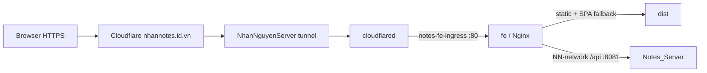

# Deploy app `fe` trên Dokploy

## Kết quả review

- Kiểm tra ngày 05/10/2026 trên máy OrbStack `nntn-vps`: ban đầu Docker Swarm và dashboard có Dokploy cùng 5 service backend/hạ tầng, chưa có app FE. Đã tạo/build/deploy `fe` trong `Nn_NotesWebApp / production`, service `nnnoteswebapp-fe-yqegwe`.
- Dashboard ban đầu trả Cloudflare 502. Log `cloudflared` ghi `connection refused` tới origin port 3000. Sau đó Dokploy healthy và domain mở được trang đăng nhập; chưa thay đổi tunnel/server.
- Backend live: `nnnoteswebapp-notesserver-oubfhi`, port `8081`, overlay network `NN-network`, image `nntn/notes-app:latest`.
- Frontend live: **https://nhannotes.id.vn**, healthy; trang chủ và deep link `/todo` đã render qua HTTPS. Các deep link khác và `/healthz` đã kiểm tra trong container. Proxy GET `/api/auth/login` nhận 403 từ backend; đây không phải kiểm thử đăng nhập thành công.
- Repo FE trước thay đổi này không có Dockerfile. Vite dev proxy `/api` không chạy trong bundle production; cần proxy ingress/server hoặc cấu hình API origin.
- Backend Compose local tại `Desktop/NotesWebApp/notesWeb/docker-compose.yml` có `notes-app`, Postgres, Redis, Kafka, RabbitMQ; không có service FE. Đây là file local, chưa chứng minh stack đang deploy giống file này.

## Cấu hình app FE

| Trường | Giá trị |
| --- | --- |
| Application name | `fe`, application ID `8fELziSraH6PTTo6FS2OB` |
| Git repository | `NNTN32/NotesWeb_FE` |
| Branch | `main`; bao gồm cập nhật giao diện mới nhất và cấu hình Docker production |
| Git Build Path | `/` |
| Docker Context Path | `mynotewebapp` |
| Build type | Dockerfile |
| Dockerfile path | `mynotewebapp/Dockerfile` tính từ Git Build Path |
| Container port | `80` |
| Health check | `/healthz` |
| Runtime environment | `API_UPSTREAM=http://nnnoteswebapp-notesserver-oubfhi:8081` khi FE cùng `NN-network` |

`API_UPSTREAM` bắt buộc, không chứa slash cuối hoặc path. Tên `notes-app` chỉ dùng được khi FE và BE cùng network và DNS alias đó có thật. Không dùng `localhost:8081` trong container FE vì localhost trỏ về chính FE. Nếu BE nằm ở app/network khác, cấu hình network chung hoặc origin HTTPS reachable trước khi deploy.

Proxy giữ nguyên URI: `/api/auth/login` → backend `/api/auth/login`. Không tự strip `/api`. Các API notes/todo trong backend có prefix khác và chưa được FE tích hợp; cấu hình này không sửa contract auth hoặc tự đồng bộ dữ liệu localStorage.

## Routing và vận hành live



- DNS apex là proxied CNAME tới tunnel hiện có; tunnel hostname `nhannotes.id.vn` route trực tiếp tới `http://nnnoteswebapp-fe-yqegwe:80`. Domain được quản lý ở Cloudflare Tunnel, không phải Traefik/Dokploy Domains.
- Swarm Settings → Network của FE lưu cả `NN-network` và `notes-fe-ingress`. Container `cloudflared` được nối vào network riêng `notes-fe-ingress`; FE không publish host port.
- Update policy FE: parallelism 1, `start-first`, failure action `rollback`, monitor 120 giây. Image có healthcheck `/healthz`; kiểm tra service hội tụ 1/1 healthy sau reload/deploy.
- Environment editor phải bỏ chế độ che/khóa trước khi nhập. Lưu `API_UPSTREAM`, tắt Create Environment File và reload/deploy để áp dụng runtime environment. Không thêm credential vào bundle.
- Kết nối Docker network của `cloudflared` giữ qua restart container; **khi recreate connector phải nối lại `notes-fe-ingress`** (hoặc khai báo external network này trong Compose quản lý connector). Không đưa tunnel token vào Git.
- Git provider hiện không có GitHub integration. Khi muốn tự deploy qua push, cấu hình webhook trong repository; giữ webhook URL như credential, không ghi vào docs. Nếu chưa cấu hình webhook, dùng Deploy trên Dokploy.
- Rollback code bằng commit/image đã kiểm chứng rồi Deploy; rollback public routing bằng cấu hình tunnel/DNS trước thay đổi. Không xóa volume dữ liệu khi rollback.

## Build và xác minh

Đã pass: 10 unit tests, ESLint, Vite production build, Docker build. Smoke test image với backend giả lập đã kiểm tra deep links, cache headers, missing asset 404, `/healthz`, POST `/api/auth/login?check=1` giữ nguyên method/URI/query và status 401, thiếu `API_UPSTREAM` khiến container dừng rõ lỗi. Đây chưa phải end-to-end auth với backend live.

```sh
docker build -t notesweb-fe:review .
docker run --rm -e API_UPSTREAM=http://notes-app:8081 -p 127.0.0.1:8080:80 notesweb-fe:review
```

Chạy từ `mynotewebapp`. Trong Docker production, nối network backend phù hợp. Kiểm tra `/`, deep links `/create`, `/todo`, `/weekly-plan`, `/auth/login`; asset không tồn tại phải trả 404; `/api/...` phải tới BE, không được trả HTML SPA. `/healthz` chỉ kiểm tra FE, không chứng minh BE hoặc auth đã hoạt động.

## Best practices cho stack

- [ ] Theo dõi lỗi tunnel origin port 3000 nếu 502 tái diễn; Dokploy hiện healthy. Không cần đổi DNS hoặc tắt bảo mật để xử lý lỗi connection refused.
- Dùng bundle `dist` với Nginx, không chạy Vite dev/preview làm server production. Docker build cài dependency từ yarn.lock bằng frozen lockfile.
- Để Dokploy/Traefik route vào container port 80, không publish thêm FE port ra host nếu không cần. Chọn domain FE và HTTPS sau khi xác nhận domain đang dùng.
- Không đưa secret vào VITE_* hoặc build args; bundle browser công khai. API_UPSTREAM là runtime origin, không chứa credential.
- HTML/deep links no-cache, hashed assets cache immutable; SPA fallback không nuốt API hoặc asset 404.
- [ ] Stack live publish Postgres `5433`, backend `8081`, RabbitMQ `5672/15672/61613` ra host. Đối chiếu client và firewall trước khi bỏ port không cần thiết. Chưa kết luận các port này truy cập được từ Internet; chưa thay đổi live.
- [ ] Kafka và RabbitMQ live chưa có volume mount: cần kế hoạch persistence và backup nếu phải giữ message sau recreate. Postgres và Redis live đã có named volume; thử restore để kiểm chứng backup.
- [ ] Backend và 4 service hạ tầng app live chưa có healthcheck. Thêm kiểm tra phù hợp từng service, theo dõi readiness; backend hiện chỉ giới hạn memory 1 GiB, các service hạ tầng chưa có resource limits.
- [ ] Postgres/Redis live dùng `start-first`: cân nhắc `stop-first` cho singleton dùng chung volume để tránh hai process chạy chồng trong update. Sắp xếp downtime/backup trước khi thay đổi; chưa thay đổi live.
- [ ] Health check Postgres trong Compose local dùng `-U postgres` nhưng user cấu hình bằng DB_USERNAME; dùng user/database thực tế khi thêm healthcheck. Không sao chép cấu hình local chưa kiểm chứng sang production.
- Pin image digest sau khi kiểm chứng image; deploy theo commit/image tag có thể rollback. Giữ bản deploy đang chạy cho đến khi FE mới qua smoke test.

## Tài liệu chính thức

- [Dokploy Vite React](https://docs.dokploy.com/docs/core/vite-react)
- [Dokploy domains và container port](https://docs.dokploy.com/docs/core/domains)
- [Vite static deployment](https://vite.dev/guide/static-deploy.html)
- [Docker Swarm service updates và rollback](https://docs.docker.com/reference/cli/docker/service/update/)
